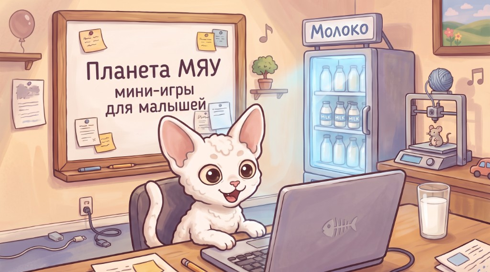

# Планета Мяу



PWA-хаб мини-игр для ребёнка **2–3 лет** на планшетах (основная платформа: **iPad landscape**). Маскот — **Мяу**.

Закрытый (проприетарный) проект — см. [`LICENSE`](LICENSE).

## Статус

Work in progress. Текущая фаза — в `docs/05-CURRENT-STATE.md`.

## Где запущено (GitHub Pages)

Постоянный адрес: https://bogdanuz.github.io/meow-planet/

Обновления происходят автоматически по `push` в `main`: GitHub Actions собирает и публикует новую версию без ручных шагов.

## Целевая аудитория и устройства

- Основной сценарий: ребёнок играет в **горизонтальном** режиме.
- Основная платформа: **iPad** и другие планшеты.
- Смартфоны — не основной target.

## Адаптивность (важно)

- **Portrait:** поверх приложения показывается экран **«Поверни планшет»**, клики по игре отключаются.
- **Слишком маленький экран/окно:** если доступный viewport по шорт-сайду меньше `720px`, показывается экран **«Планета Мяу ждёт тебя на планшете»**.

Подробности логики гейтов: `src/app/orientation-gate.ts`, `src/app/small-viewport-gate.ts`.

## Быстрый старт

```bash
npm install
npx playwright install
npm run dev
```

## Команды

- `npm run typecheck`
- `npm run test` (Vitest)
- `npm run build` (сборка + генерация PWA)
- `npm run test:e2e` (Playwright)

**Git:** коммиты и push — только через **GitHub Desktop** (не консоль).

## PWA / офлайн

Проект использует `vite-plugin-pwa` (Workbox). В production сборке генерируется `sw.js`, а сервис-воркер обеспечивает offline-кеширование ассетов приложения.

Service Worker обновляется без диалогов (`registerType: autoUpdate`), а при новом деплое устаревшие кэши очищаются — поэтому iPad/планшеты со временем получают актуальные файлы.

## Структура проекта (кратко)

- `src/app/` — shell, роутер, гейты ориентации/размера, boot-последовательность
- `src/games/` — игровые модули
- `src/shared/` — общие утилиты (audio, storage, soft-error и т.п.)
- `public/` — runtime-ассеты (иконки, арт, звуки)
- `tests/` — unit/e2e
- `assets-master/` — исходники ассетов; используется для генерации и игнорируется GitHub через `.gitignore`

## Известные ограничения

См. `BACKLOG.md`.

## Лицензия

см. [`LICENSE`](LICENSE).
